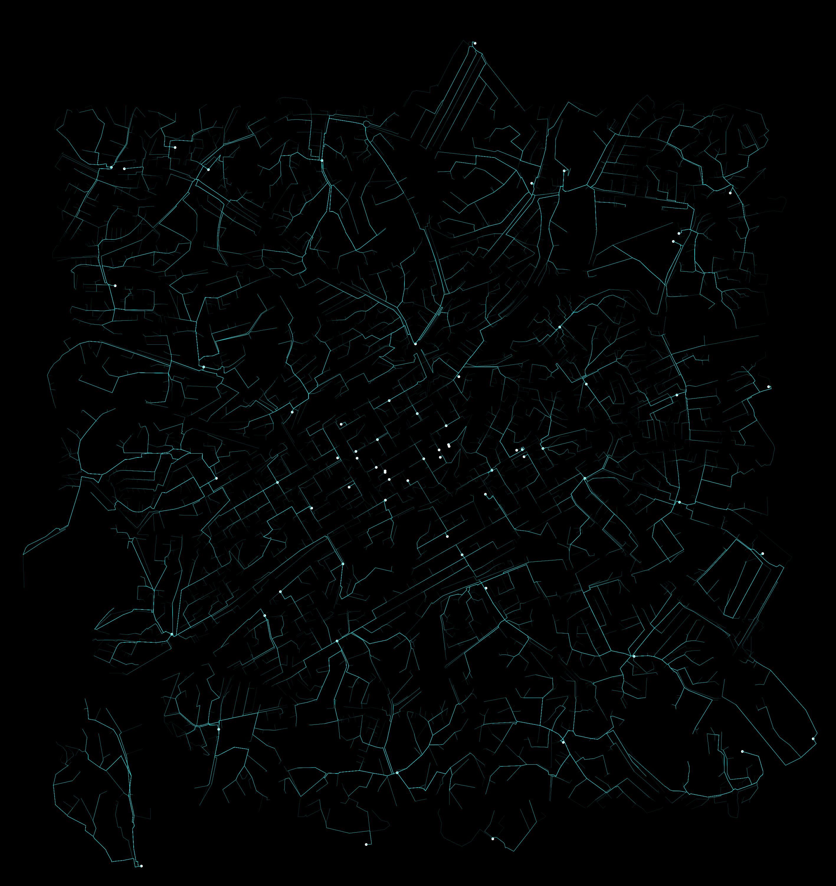
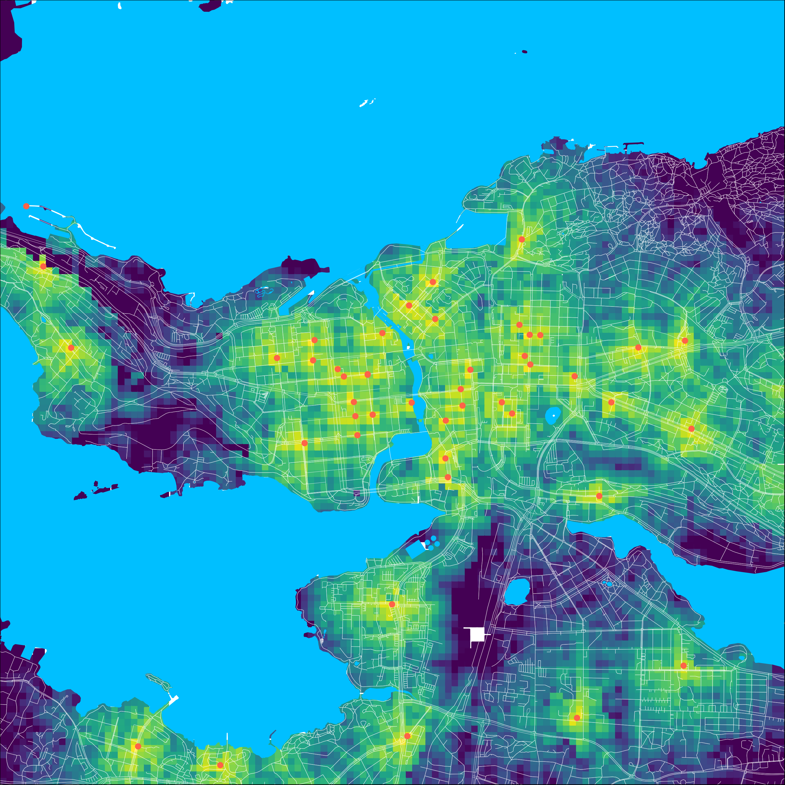

## Accessibility of grocers by bike
- I wanted to create a tool that can create accessibility maps of any city (currently only in Finland due to hardcoded projections) with as little user input as possible.
- Grocers (Convenience stores and supermarkets in OSM terminology) were chosen for this example because they are needed often and are thus important.
  - The code can be easily modified in the future to search different types of services
- Cycling was chosen as the method of transportation, because cycling is my favorite method of transportation, and it also has other key benefits for the analysis.
  -  Cycling usually follows route networks and less shortcuts can be taken than when walking
  -  A trip to a grocery store by bike is more likely to go to the nearest (possibly small) store compared to a grocery trip by car.
- This project started as my final excercise for [Automating gis processes](https://autogis-site.readthedocs.io/en/latest/)  

Cycling routes to the nearest grocer in Turku (distance based on network)
### Input data:
- cities.csv:
  - The wanted cities' names, one row per city name. The name should not include commas, but can include spaces for extra specification, for example Oulu Finland is valid.
- The road network, water areas (except seas) and grocery stores (conveniences and supermarket in OSM) are fetched automatically trough osmnx based on the location.
### Optional Input data:
- Finnish national land surveys sea areas (MTK-vakavesi_yr_mo_da.gpkg)
  - The sea areas do not load properly, this fixes that. If this would be developed further a better solution should be found.
### Analysis steps:
1. Reading the names from cities.csv
2. Geolocating the names with Nominatim
3. then, for each city
  - Creating a square buffer around the point location.
  - All the needed data (bodies of water, cycling network as well as convenience stores and supermarkets) are fetched from inside the buffer with osmnx
  - A point grid is created to the area. Shortest route to grocery store is calculated for each point in the grid. Points falling to water are removed
  - A K-D tree of the grocers is build and queried to find k (three was determined to be good balance of performance and reliability) nearest (euclidean distance) grocery stores. This is done so that only the routes to the closest shops need to be calculated. 
  - The aforementioned routing is calculated, and the shortest route is retained. Also the distance from the origin node to the closest graph node is saved.
  - Time to walk to the cycling network (slowly with the bike in possibly rough terrain) and time to cycle the route are calculated and summed. It should be noted that the end result does not take hills into account. Also, the result is approximate and depends a lot on the person cycling.
  - Maps of the routes and accessibility are made and saved.
  - The median cycling time to grocer is calculated for the city
4. The median accessibility times are shown for each city
### Results:
- The median time to access grocery stores of Tampere was slightly faster by bike than in Turku.
- Cool maps and the approximate "customershed" of each grocery store in the area. Naturally this doesn't take into account any other factors than distance, which is unrealistic. However, it's a good starting point and is probably somewhat close at least for convenience stores.
- Accessibility maps of the cities, which can be useful in many ways.

Map of accessibility of grocers in Tampere by bike in minutes. Yellow colors indicate time of under 1 minute, and darkest colors indicate time of over 5 mins
### References:

- Walking speed estimate
Raymond et al. Effects of obesity and sex on the energetic cost and preferred speed of walking https://doi.org/10.1152/japplphysiol.00767.2005

- Copenhagen cycling statistics, used for speed estimate
https://web.archive.org/web/20131212093813/http://subsite.kk.dk/sitecore/content/Subsites/CityOfCopenhagen/SubsiteFrontpage/LivingInCopenhagen/CityAndTraffic/CityOfCyclists/CycleStatistics.aspx
